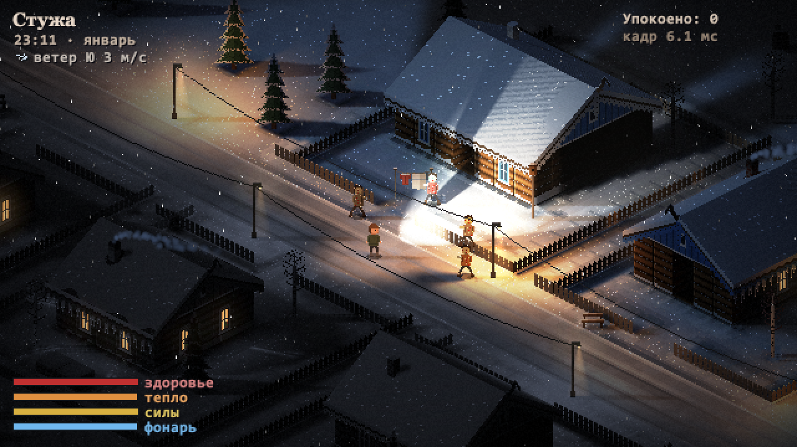
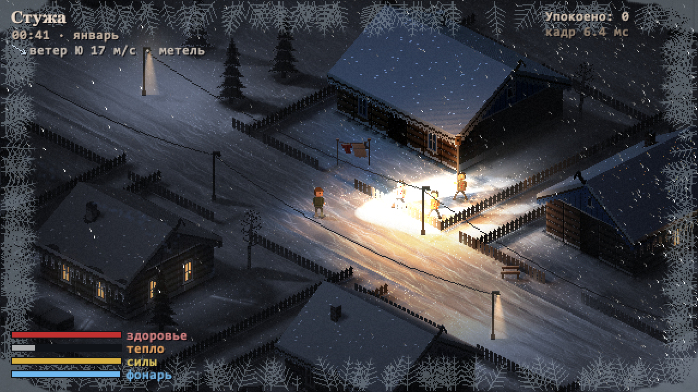
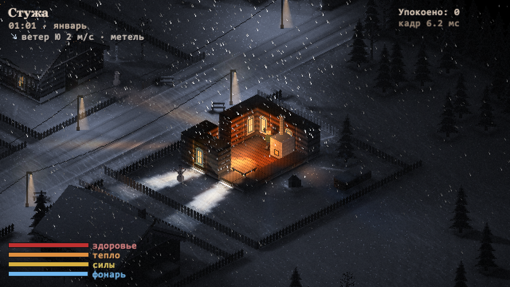
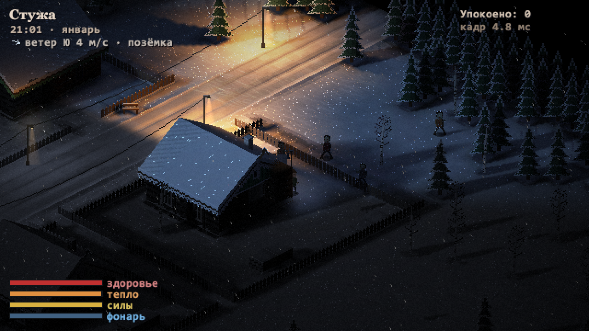
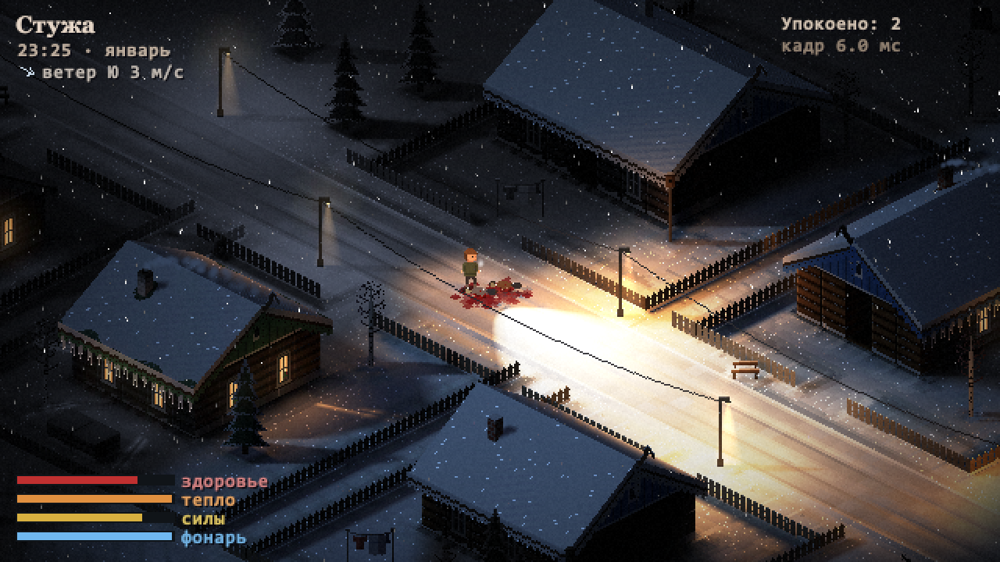

<div align="center">

# Стужа

*Stuzha* (“bitter cold”): an isometric winter-night survival game written
entirely in x86-64 assembly.




</div>

---

## English

A Siberian village on a January night. The dead wander the streets; you have a
shovel, a flashlight and a warm izba somewhere nearby. Survive from 17:20 until
dawn at 08:00 (about nine and a half real minutes).

There is no engine, no libraries beyond the Windows system DLLs, and no asset
files. The village, sprites, light, weather and sound are all produced by
~29k lines of hand-written NASM. The game is a single 250 KB executable.

**What's inside**

- **Software renderer.** 640×360, scaled to the window. It uses a G-buffer
  (albedo, normals, world position) with deferred lighting on SSE2. The moon
  casts contact-hardening soft shadows from a height map. There is also a view
  cone that greys out what you cannot see, bloom and a frost overlay.
- **Per-pixel light.** Street lamps, lit windows, the stove and the TV are
  computed for every pixel: 3D falloff, soft N·L, and shadows from each light's
  horizon map with a penumbra that widens away from the fence or wall casting
  it. People and zombies cast shadows too. A window throws its frame, curtains
  and whatever sits on the sill onto the snow, sharp by the wall and blurrier
  farther out. The flashlight is a spotlight with a hot centre and a reflector
  ring, zombies block it, and in a blizzard you see the beam in the air. Lit
  snow bounces warm light onto walls and figures from below and glints under
  the lamps, and highlights roll off smoothly instead of clipping to white.
  The screen is split into 16×16 tiles, and each tile only evaluates the
  lights that reach it.
- **Fast on every core.** Per-row passes run on a small thread pool, the moon
  shadow sweep runs in the background while objects are drawn, and HUD text and
  presenting happen on their own output thread. The lighting pass has an AVX2
  path (8 pixels per step) next to the SSE2 one. Every path produces the same
  frame down to the byte, which is checked against the single-threaded SSE2
  build. On an i7-7700 a frame takes about 5.5 ms (around 180 fps).
- **The world.** Gabled snow roofs are rasterized in world planes with
  per-pixel depth. There are snow drifts with normals, and footprints and blood
  that stay in the snow. Walls are cut away around the player, and collisions
  follow the sprite shapes.
- **Wind as a system.** Each night has its own weather script: calm, then
  ground drift, a blizzard and a morning breeze. The gust field is sheltered
  behind houses, fences and trees, and it moves snowfall, drifting snow, chimney
  smoke, trees and wires. Zombies hear you farther downwind and smell your
  scent trail. The wind slows you when you walk into it and chills you until
  you get to a stove.
- **Synthesized sound.** A waveOut thread mixes it all in real time from
  filters and oscillators, with no samples. It includes wind that differs
  between your left and right ear, howling at corners and fences, singing
  wires, and footsteps on snow, packed road and floorboards. You also hear
  the shovel, zombie voices, dogs and stove crackle. A TV mumbles through a
  wall. Sounds carry with the wind and are muffled by walls.

**Controls**

| Key | Action |
|---|---|
| WASD | walk |
| Shift | run |
| LMB / Space | swing the shovel |
| F | flashlight |
| M | sound on/off |
| F11 / Alt+Enter | fullscreen |
| F3 | show hitboxes |
| R / Esc | restart / quit (after the night ends) |

**Building**

You need [NASM](https://nasm.us) 2.15+ and mingw-w64 binutils
(`x86_64-w64-mingw32-ld`), either on `PATH` or inside WSL:

```sh
sh build.sh        # -> build/stuzha.exe
```

**Checking without playing**

The game can render fixed-seed scenes to files, which is how it was developed:

| Flag | Output |
|---|---|
| `--shot1` … `--shot9`, `--shot0` | `build/shotN.bmp`: night, dusk, inside an izba, walk, fight, death, yard, flashlight, dawn, behind a house |
| `--shotw`, `--shotb`, `--shotz` | wind at 21:40, a blizzard, the scent test (`zlog.bin`) |
| `--wav` (with a shot) | also records the scene's sound to `shotN.wav` |
| `--sndtest` | every sound event and ambience in a row → `sndtest.wav` |
| `--hb`, `--lm`, `--wind`, `--soak` | hitboxes, baked lamp light, wind field from above, 3000-frame soak |
| `--fs`, `--alog` | start fullscreen; log audio buffer underruns to `alog.bin` |
| `--intro` (with a shot) | draws the title overlay over the shot |
| `--bench` (with a shot) | runs the scene in a live window for 600 frames and writes per-pass timings to `bench.bin` |
| `--threads N`, `--noavx` | limit the render thread pool; use only the SSE2 path |

`build/topng.ps1 -n "1,b"` converts shots to PNG. `build/bench.ps1 -n 1` runs
`--bench` and prints min / median / p90 for every pass.

## Русский

Сибирское село январской ночью. По улицам бродят мёртвые, у тебя лопата,
фонарь и где-то рядом тёплая изба. Нужно дожить с 17:20 до рассвета в 08:00,
это примерно девять с половиной минут.

Ни движка, ни библиотек, кроме системных DLL Windows, ни файлов с ресурсами.
Село, спрайты, свет, погода и звук целиком получаются из ~29 тыс. строк NASM,
написанных руками. Вся игра — один exe на 250 КБ.

**Что внутри**

- **Софтверный рендер.** 640×360 с масштабом под окно. Это G-буфер (цвет,
  нормали, мировые координаты) и отложенное освещение на SSE2. Луна даёт мягкие
  тени по карте высот. Ещё там конус обзора (невидимое — серой памятью), блум и
  иней по краям экрана.
- **Свет попиксельно.** Фонари, окна, печь и телевизор считаются на каждый
  пиксель: затухание в 3D, мягкое N·L и тени по карте горизонта каждого огня,
  с полутенью, что растёт от забора или стены. Люди и зомби тоже отбрасывают
  тени. Окно кладёт на снег свою раму, шторы и то, что стоит на подоконнике: у
  стены резко, дальше размыто. Фонарик — прожектор с горячей серединой и
  кольцом рефлектора, зомби его заслоняют, а в метель луч виден в воздухе.
  Освещённый снег подсвечивает стены и фигуры снизу и искрится под фонарями,
  а пересвет плавно уходит в насыщение, а не в белое пятно. Экран поделён на
  плитки 16×16, и каждая считает только те огни, что до неё достают.
- **На всех ядрах.** Построчные проходы идут на пуле потоков, тени луны
  считаются фоном, пока рисуются объекты, надписи и вывод в окно — в своём
  потоке. У освещения есть путь на AVX2 (8 пикселей за шаг) рядом с SSE2. Все
  пути дают один и тот же кадр до байта, это сверяется с однопоточной SSE2-сборкой.
  На i7-7700 кадр занимает около 5,5 мс (около 180 fps).
- **Мир.** Двускатные крыши в снегу растеризуются в мировых плоскостях с
  попиксельной глубиной. Есть сугробы с нормалями, следы и кровь, которые
  остаются на снегу. Стены срезаются вокруг игрока, а столкновения повторяют
  форму спрайтов.
- **Ветер как система.** У каждой ночи свой сценарий погоды: тишина, потом
  позёмка, метель и утренний ветерок. Поле порывов с затишьем за избами,
  заборами и деревьями двигает снег, позёмку, дым, деревья и провода. Зомби
  слышат дальше по ветру и чуют запах. Против ветра идти тяжелее, а без печки
  замерзаешь.
- **Синтезированный звук.** Поток на waveOut в реальном времени смешивает всё
  из фильтров и генераторов, без сэмплов. Ветер в левом и правом ухе разный,
  воет на углах и заборах, гудят провода. Шаги звучат по-своему на снегу,
  укатанной дороге и половицах. Ещё слышно лопату, голоса зомби, собак, треск
  печки и телевизор за стеной. Звуки несёт ветром и глушат стены.

**Управление:** WASD — идти, Shift — бежать, ЛКМ/Пробел — лопата, F — фонарь,
M — звук, F11 или Alt+Enter — полный экран, F3 — хитбоксы; после конца ночи
R — заново, Esc — выход.

**Сборка:** нужны NASM 2.15+ и mingw-w64 binutils (`x86_64-w64-mingw32-ld`) —
в `PATH` или в WSL. Команда `sh build.sh` собирает `build/stuzha.exe`.

**Проверка без игры:** флаги `--shotN`, `--wav`, `--sndtest` и остальные из
таблицы выше пишут снимки сцен и их звук в файлы. Так игра и разрабатывалась.
`--bench` с `build/bench.ps1` меряют каждый проход кадра, `--threads N` и `--noavx`
ограничивают потоки и отключают AVX2.

## Screenshots

| | |
|---|---|
|  |  |
|  |  |

## License

MIT, see [LICENSE](LICENSE).
