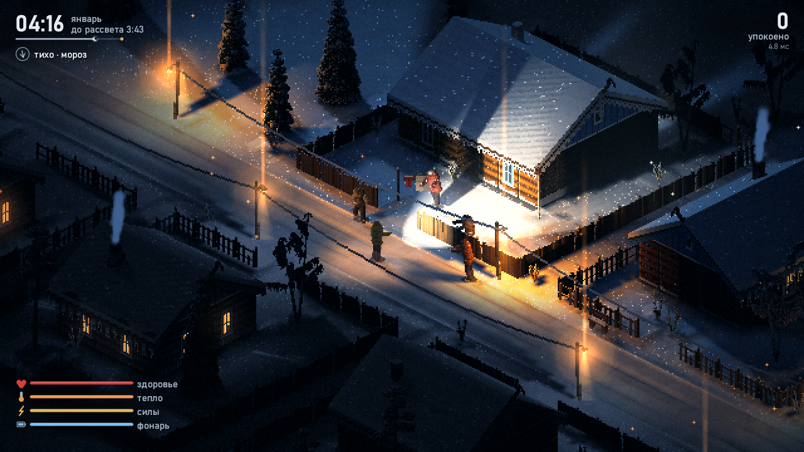
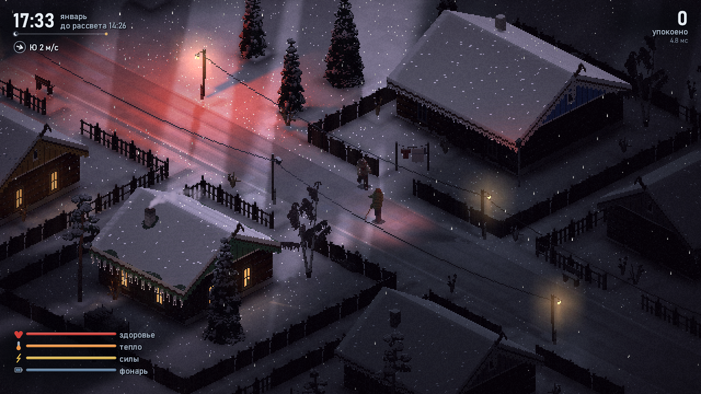

<div align="center">

# Стужа

*Stuzha* (“bitter cold”): an isometric winter-night survival game written
entirely in x86-64 assembly.


</div>

---

## English

A Siberian village on a January night. The dead wander the streets; you have a
shovel, a flashlight and a warm izba somewhere nearby. Survive from 17:20 until
dawn at 08:00 (about nine and a half real minutes).

There is no engine, no libraries beyond the Windows system DLLs, and no asset
files. The village, trees, people, light, weather and sound are all produced by
~51k lines of hand-written NASM. The game is a single 583 KB executable.

**What's inside**

- **Software renderer.** 640×360, scaled to the window. It uses a G-buffer
  (albedo, normals, world position) with deferred lighting on SSE2. The moon
  casts contact-hardening soft shadows from a height map. There is also a view
  cone that greys out what you cannot see, bloom and a frost overlay.
- **HUD at window resolution.** The frame is scaled to the window first, and
  the HUD is drawn on top at full resolution. Text is rasterized for the
  current scale into a glyph cache, each glyph with a soft shadow. Bars, icons,
  the night-to-dawn line and the wind compass are anti-aliased shapes computed
  from their distance to the outline, four pixels at a time.
- **Per-pixel light.** Street lamps, lit windows, the stove and the TV are
  computed for every pixel: 3D falloff, soft N·L, and shadows from each light's
  horizon map with a penumbra that widens away from the fence or wall casting
  it. People and zombies cast shadows too. A window throws its frame, curtains
  and whatever sits on the sill onto the snow, sharp by the wall and blurrier
  farther out. The flashlight is a spotlight with a hot centre and a reflector
  ring, zombies block it, and in a blizzard you see the beam in the air. Lit
  snow bounces warm light onto walls and figures from below and glints under
  the lamps. Highlights roll off smoothly, and the brightest ones bleach
  toward white the way film does, so the sodium pool under a lamp turns
  pale yellow at its heart instead of a flat orange. The screen is split
  into 16×16 tiles, and each tile only evaluates the lights that reach it.
- **Colour grading and the eye.** The last pass regrades the finished frame
  from a table keyed on brightness: a tone curve, night vision that turns
  shadows blue and drains their colour while lamps and windows stay warm,
  and tints for shadows and highlights. Five palettes (dusk, night,
  blizzard, frost and dawn) blend by the hour and the weather, and a frozen
  player sees the world paler. The eye adapts. In a lit izba it gets used to
  the light, so when you step outside the night is nearly black for a couple
  of seconds until your eyes adjust. A flashlight aimed at a wall at point
  blank dazzles you in the same way, and standing in the dark lets you see a
  little further. Bloom leaves a faint red halation around bright lights.
- **Fast on every core.** Per-row passes run on a small thread pool. Objects
  and roofs are drawn in horizontal screen bands at once: every band replays
  the same painter's order but writes only its own rows, and the band edges
  follow last frame's timings. The moon shadow sweep runs on a background
  thread from the start of the frame until the light pass needs it. Scaling
  to the window, the HUD and presenting happen on their own output thread,
  while the next frame is being rendered. Lighting and the
  floor have AVX2 paths (8 pixels per step) next to the SSE2 ones. Every path
  produces the same frame down to the byte, which is checked against the
  single-threaded SSE2 build. On an i7-7700 a frame takes about 5 ms
  (around 200 fps).
- **The world.** Gabled snow roofs are rasterized in world planes with
  per-pixel depth. There are snow drifts with normals, and footprints and blood
  that stay in the snow. Walls are cut away around the player, and collisions
  follow the shapes on screen.
- **Trees are small 3D models.** At startup every spruce, pine, birch, young
  spruce, willow, dry weed and stump is grown from thousands of spheres:
  drooping spruce tiers with snow pillows on top, pine limbs ending in clumps
  of needles, white birch bark with black lenticels and long hanging twigs.
  Then the game camera photographs each model into a sprite that keeps a
  normal and a world position for every pixel. A street lamp lights the near
  side of a spruce and leaves the far side dark, and the moon casts the shape
  of the actual crown, so a birch throws a lacy shadow on a roof. Each species
  has several variants, mirrored and shifted per tile. Pines grow in groves,
  young spruces and willows fill the forest edge, and dry weeds stand along
  the fences.
- **The yard is built the same way.** Fences, street lamps, benches,
  woodpiles, kennels, birdhouses, crosses, snowmen, washing lines and the
  sweep well are models of boards, beams, logs and spheres, photographed by
  the same camera. A picket fence has rails behind the pickets, a board fence
  stands dark and solid, and some pickets are missing or leaning. A street
  lamp is a wooden pole strapped to a concrete stub, with insulators and a
  glowing glass under the head. A bench stands along the fence with its back
  to it, and the log ends of a woodpile show their rings. Snow lies on every
  surface that is open to the sky. The yard casts real shadows too.
- **People are posed capsule figures.** The player and the zombies are
  skeletons of about 25 capsules, posed every frame and ray-cast into the
  G-buffer. They can face any direction and are lit from any side. When
  walking, the hips ride on the straight leg. A running player takes longer
  strides, kicks the heels up, leaves the ground between steps, pumps the
  arms and carries the shovel forward with the shaft level. Zombies lurch and some of them
  limp; they reach forward in a chase, lunge when they strike and reel back
  when hit. There are six zombie outfits: a quilted jacket with an ushanka, a
  coat with a headscarf, a sheepskin, a sweater, a cap, and an old woman's
  shawl. Clothes carry blood and settle snow, and a corpse slowly disappears
  under it.
- **Every izba is furnished differently.** When the roof comes off you see
  log walls, whitewash over a painted dado, patterned wallpaper or board
  panelling, and a floor that is bare, red, ochre or grey. There is a bed
  with a patchwork quilt (wooden or iron), a wardrobe or a glass-front
  sideboard with dishes, a painted chest and a bench. A carpet hangs over the
  bed, and there may be an icon with an embroidered towel and a lit lampada, a
  pendulum clock, photos, a calendar, a mirror or a shelf. On the table there
  is a tablecloth or oilcloth with a samovar, a geranium pot or a flickering
  TV, and rag runners lie on the floor. Windows show curtains and the night
  from the inside. Furniture is drawn as boxes with per-pixel depth and normals,
  so lamps and the flashlight light it like everything else. The layout
  comes from a hash of the house's position and always leaves a path from the
  door.
- **Loot.** Houses hold batteries, bandages, thermoses of tea and tinned meat.
  Some lie on tables, beds and floors, and the rest are hidden in chests and
  wardrobes. Abandoned dark houses have more. E picks up or searches, and
  1–4 use an item from your stock: batteries refill the flashlight, a bandage
  heals, tea warms you, and food restores health and stamina.
- **Wind as a system.** Each night has its own weather script: calm, then
  ground drift, a blizzard, a clear still frost and a morning breeze. The gust field is sheltered
  behind houses, fences and trees, and it moves snowfall, drifting snow, chimney
  smoke, trees and wires. Zombies hear you farther downwind and smell your
  scent trail. The wind slows you when you walk into it and chills you until
  you get to a stove.
- **Hard frost.** After the blizzard the sky clears, the wind dies and the
  cold deepens. Ice crystals hang in the air: they draw light pillars above
  the street lamps, soft halos with a faint ring around the lamps, and
  diamond dust that sparkles for an instant wherever a lamp, a window or
  your flashlight catches it. Chimney smoke rises in straight columns and
  spreads out under the inversion. Hoarfrost builds up on branch outlines
  and the wires turn white and thick with it. It stays until the morning
  wind shakes it off.
- **Synthesized sound.** A waveOut thread mixes it all in real time from
  filters and oscillators, with no samples. It includes wind that differs
  between your left and right ear, howling at corners and fences, and
  singing wires. A footstep is a shower of tiny snow fractures, denser under
  the heel than under the toe: a soft crunch on loose snow, a frosty squeak
  on the packed road, felt boots on floorboards, where some boards always
  creak. Dogs, the chained dog's growl and roosters come from a small voice
  model: vocal-fold pulses with jitter and subharmonics, breath noise and
  four moving mouth formants, with pitch contours measured from recordings.
  Every village dog keeps its own yard and voice for the night, and barks
  echo off the forest. Roosters crow at midnight, at two and before dawn,
  answering each other. The stove flickers and crackles in bursts, a TV
  mumbles through a wall. Sounds carry with the wind and are muffled by
  walls; the reverb is an 8-line feedback delay network.

**Controls**

| Key | Action |
|---|---|
| WASD | walk |
| Shift | run |
| LMB / Space | swing the shovel |
| F | flashlight |
| E | pick up / search a chest or wardrobe |
| 1 – 4 | use batteries, bandage, tea, food |
| M | sound on/off |
| F11 / Alt+Enter | fullscreen |
| F3 | show hitboxes |
| R / Esc | restart / quit (after the night ends) |

**Building**

You need [NASM](https://nasm.us) 2.15+ and mingw-w64 binutils
(`x86_64-w64-mingw32-ld`), either on `PATH` or inside WSL:

```sh
sh build.sh        # -> build/stuzha.exe
```

**Checking without playing**

The game can render fixed-seed scenes to files, which is how it was developed:

| Flag | Output |
|---|---|
| `--shot1` … `--shot9`, `--shot0` | `build/shotN.bmp` (the 640×360 frame) and `build/viewN.bmp` (scaled to 1920×1080 with the HUD): night, dusk, inside an izba, walk, fight, death, yard, flashlight, dawn, behind a house |
| `--shotw`, `--shotb`, `--shotf`, `--shotz` | wind at 21:40, a blizzard, the frost at 04:15, the scent test (`zlog.bin`) |
| `--wav` (with a shot) | also records the scene's sound to `shotN.wav` |
| `--sndtest` | every sound event and ambience in a row, then a distant dog and rooster → `sndtest.wav` |
| `--hb`, `--lm`, `--wind`, `--soak` | hitboxes, baked lamp light, wind field from above, 3000-frame soak |
| `--fs`, `--alog` | start fullscreen; log audio buffer underruns to `alog.bin` |
| `--intro` (with a shot) | draws the title overlay over the shot |
| `--house N`, `--pick 1\|2` (with `--shot3`) | inside the N-th izba; next to its first item or container, pressing E (and 1–4) just before the shot |
| `--albedo` (with a shot) | writes the unlit G-buffer colours to `shotN.bmp` |
| `--veg`, `--figs` (with a shot) | every plant and yard model in rows; every zombie outfit, the player walking and running, in eight turns |
| `--view N` (with a shot) | height of `viewN.bmp` (16:9), 1080 by default |
| `--bench` (with a shot) | runs the scene in a live window for 600 frames and writes per-pass timings to `bench.bin` |
| `--threads N`, `--noavx` | limit the render thread pool; use only the SSE2 path |

`build/topng.ps1 -n "1,b"` converts shots to PNG (with the HUD). `build/bench.ps1 -n 1`
runs `--bench` and prints min / median / p90 for every pass.
`build/cmp.py` compares frames with a saved reference down to the byte.

## Русский

Сибирское село январской ночью. По улицам бродят мёртвые, у тебя лопата,
фонарь и где-то рядом тёплая изба. Нужно дожить с 17:20 до рассвета в 08:00,
это примерно девять с половиной минут.

Ни движка, ни библиотек, кроме системных DLL Windows, ни файлов с ресурсами.
Село, деревья, люди, свет, погода и звук целиком получаются из ~51 тыс. строк
NASM, написанных руками. Вся игра — один exe на 583 КБ.

**Что внутри**

- **Софтверный рендер.** 640×360 с масштабом под окно. Это G-буфер (цвет,
  нормали, мировые координаты) и отложенное освещение на SSE2. Луна даёт мягкие
  тени по карте высот. Ещё там конус обзора (невидимое — серой памятью), блум и
  иней по краям экрана.
- **HUD в разрешении окна.** Кадр сперва растягивается под окно, а HUD
  рисуется поверх в полном разрешении. Буквы растеризуются под текущий масштаб
  в кэш глифов, у каждой мягкая тень. Полосы, значки, линия ночи до рассвета и
  компас ветра — сглаженные фигуры по расстоянию до контура, по 4 пикселя за
  шаг.
- **Свет попиксельно.** Фонари, окна, печь и телевизор считаются на каждый
  пиксель: затухание в 3D, мягкое N·L и тени по карте горизонта каждого огня,
  с полутенью, что растёт от забора или стены. Люди и зомби тоже отбрасывают
  тени. Окно кладёт на снег свою раму, шторы и то, что стоит на подоконнике: у
  стены резко, дальше размыто. Фонарик — прожектор с горячей серединой и
  кольцом рефлектора, зомби его заслоняют, а в метель луч виден в воздухе.
  Освещённый снег подсвечивает стены и фигуры снизу и искрится под фонарями.
  Пересвет плавно уходит в насыщение, а самое яркое белеет, как на плёнке:
  натриевое пятно под фонарём в середине бледно-жёлтое, а не плоско-оранжевое.
  Экран поделён на плитки 16×16, и каждая считает только те огни, что до неё
  достают.
- **Цвет и глаз.** Последний проход перекрашивает готовый кадр по таблице от
  яркости: тоновая кривая, ночное зрение (тени синеют и теряют цвет, а фонари
  и окна остаются тёплыми), оттенки теней и светов. Пять палитр — сумерки,
  ночь, метель, мороз и рассвет — смешиваются по часу и погоде, а продрогшему
  мир кажется бледнее. Глаз привыкает: в избе при свете он настраивается на
  свет, и когда выходишь, пару секунд ночь почти чёрная, пока глаза не
  привыкнут. Так же слепит фонарик, если светить в стену в упор, а в темноте
  со временем видишь чуть дальше. Блум оставляет вокруг ярких огней лёгкий
  красноватый ореол, как халация на плёнке.
- **На всех ядрах.** Построчные проходы идут на пуле потоков. Объекты и крыши
  рисуются сразу горизонтальными полосами экрана: каждая полоса проходит тот же
  порядок художника, но пишет только свои строки, а границы полос следуют за
  временем прошлого кадра. Тени луны считаются фоновым потоком с начала кадра до
  прохода света. Растяжка под окно, HUD и вывод идут в своём потоке, пока
  считается следующий кадр. У освещения и пола
  есть пути на AVX2 (8 пикселей за шаг) рядом с SSE2. Все пути дают один и тот
  же кадр до байта, это сверяется с однопоточной SSE2-сборкой. На i7-7700 кадр
  занимает около 5 мс (около 200 fps).
- **Мир.** Двускатные крыши в снегу растеризуются в мировых плоскостях с
  попиксельной глубиной. Есть сугробы с нормалями, следы и кровь, которые
  остаются на снегу. Стены срезаются вокруг игрока, а столкновения повторяют
  то, что нарисовано.
- **Деревья — маленькие 3D-модели.** При запуске каждая ель, сосна, берёза,
  ёлочка подроста, куст ивняка, бурьян и пень выращиваются из тысяч шариков:
  у ели никнущие ярусы со снежными подушками, у сосны сучья с пучками хвои на
  концах, у берёзы белая кора с чёрными чёрточками и длинные свисающие
  веточки. Потом камера игры «снимает» модель в картинку, где у каждого
  пикселя есть нормаль и своя точка в мире. Фонарь освещает ближний бок ели, а
  дальний остаётся тёмным; луна отбрасывает тень настоящей кроны, так что
  берёза кладёт на крышу кружевную тень. У каждой породы несколько вариантов,
  на тайле они зеркалятся и сдвигаются. Сосны растут рощами, опушку заполняют
  подрост и ивняк, вдоль заборов стоит сухой бурьян.
- **Двор собран так же.** Заборы, фонари, лавочки, поленницы, будки,
  скворечники, кресты, снеговики, бельевые верёвки и колодец-журавль — модели
  из досок, брусьев, брёвен и шариков, снятые той же камерой. У штакетника за
  штакетинами видны прожилины, сплошной забор стоит тёмной стеной, где-то
  штакетины не хватает или она покосилась. Фонарь — деревянный столб на
  бетонном пасынке, с изоляторами и светящимся стеклом под корпусом. Лавочка
  стоит вдоль забора спинкой к нему, у поленницы видны кольца на срезах. Снег
  лежит на всём, что открыто сверху, и двор отбрасывает настоящие тени.
- **Люди — фигуры из капсул в позе.** Игрок и зомби — скелеты примерно из 25
  капсул. Поза считается каждый кадр, фигура рисуется лучом в G-буфер, поэтому
  она может смотреть куда угодно, и свет ложится на неё с любой стороны. На
  ходу таз едет по прямой ноге. На бегу у игрока шаг длиннее, пятки
  забрасываются, между шагами он отрывается от земли, руки работают, а лопату
  он несёт черенком вперёд. Зомби шатаются, иные хромают, в погоне тянут
  руки, при ударе делают выпад, а от лопаты отшатываются. Одежда шести видов:
  ватник с ушанкой, пальто с платком, тулуп, свитер, кепка и бабкина шаль. На
  одежде кровь и снег, а труп понемногу заметает.
- **В каждой избе своё убранство.** Когда снимается крыша, внутри видны
  брёвна, побелка над крашеной панелью, обои с узором или вагонка. Пол
  некрашеный, суриком, охрой или серый. Там кровать с лоскутным одеялом,
  деревянная или железная, шкаф или буфет с посудой за стеклом, крашеный
  сундук и лавка. Над кроватью висит ковёр, а ещё могут быть икона с рушником
  и горящей лампадой, ходики с маятником, фотокарточки, календарь, зеркало,
  полка. На столе скатерть или клеёнка, на ней самовар, кринка с геранью или
  мерцающий телевизор. На полу лежат полосатые половики. Окна изнутри со
  шторами, за стеклом ночь. Мебель — коробки с попиксельной глубиной и
  нормалями, поэтому свет ламп и фонарика ложится на неё как на всё остальное.
  Расстановка берётся из хеша места избы, и от двери всегда остаётся проход.
- **Лут.** В избах лежат батарейки, бинты, термосы с чаем и тушёнка: одно на
  столах, кроватях и полу, другое спрятано в сундуках и шкафах. В тёмных
  брошенных избах добра больше. E — взять или обыскать, 1–4 — пустить в ход
  из запаса: батарейки заряжают фонарь, бинт лечит, чай греет, еда
  возвращает здоровье и силы.
- **Ветер как система.** У каждой ночи свой сценарий погоды: тишина, потом
  позёмка, метель, ясный тихий мороз и утренний ветерок. Поле порывов с
  затишьем за избами, заборами и деревьями двигает снег, позёмку, дым, деревья
  и провода. Зомби слышат дальше по ветру и чуют запах. Против ветра идти
  тяжелее, а без печки замерзаешь.
- **Мороз.** После метели небо очищается, ветер стихает, и мороз крепчает. В
  воздухе висят ледяные кристаллы: над фонарями встают световые столбы, вокруг
  ламп — мягкий ореол с бледным кольцом, а алмазная пыль вспыхивает на миг
  там, где её ловит свет фонаря, окна или фонарика. Дым из труб поднимается
  ровным столбом и растекается под слоем инверсии. По краям веток нарастает
  иней, провода белеют и толстеют. Он держится, пока утренний ветер его не
  стряхнёт.
- **Синтезированный звук.** Поток на waveOut в реальном времени смешивает всё
  из фильтров и генераторов, без сэмплов. Ветер в левом и правом ухе разный,
  воет на углах и заборах, гудят провода. Шаг — россыпь мелких изломов снега,
  под пяткой гуще, чем под носком: мягкий хруст по рыхлому, морозный скрип по
  укатанной дороге, валенки по половицам, и некоторые доски всегда скрипят.
  Собак, рык цепного пса и петухов даёт маленькая модель голоса: толчки связок
  с дрожью и подгармоникой, шум дыхания и четыре подвижные форманты пасти,
  высота снята с записей. У каждой собаки на всю ночь свой двор и голос, лай
  отдаётся эхом от леса. Петухи поют в полночь, в два и перед рассветом и
  перекликаются. Печь трепещет и трещит вспышками, телевизор бубнит за стеной.
  Звуки несёт ветром и глушат стены, реверберация — сеть из 8 задержек.

**Управление:** WASD — идти, Shift — бежать, ЛКМ/Пробел — лопата, F — фонарь,
E — взять или обыскать, 1–4 — батарейки, бинт, чай, еда из запаса, M — звук,
F11 или Alt+Enter — полный экран, F3 — хитбоксы; после конца ночи R — заново,
Esc — выход.

**Сборка:** нужны NASM 2.15+ и mingw-w64 binutils (`x86_64-w64-mingw32-ld`) —
в `PATH` или в WSL. Команда `sh build.sh` собирает `build/stuzha.exe`.

**Проверка без игры:** флаги `--shotN`, `--wav`, `--sndtest` и остальные из
таблицы выше пишут снимки сцен и их звук в файлы: кадр 640×360 — в `shotN.bmp`,
он же растянутый с HUD — в `viewN.bmp`. Так игра и разрабатывалась.
`--bench` с `build/bench.ps1` меряют каждый проход кадра, `--threads N` и `--noavx`
ограничивают потоки и отключают AVX2.

## Screenshots

| | |
|---|---|
|  |  |
|  |  |
|  |  |

## License

MIT, see [LICENSE](LICENSE).
